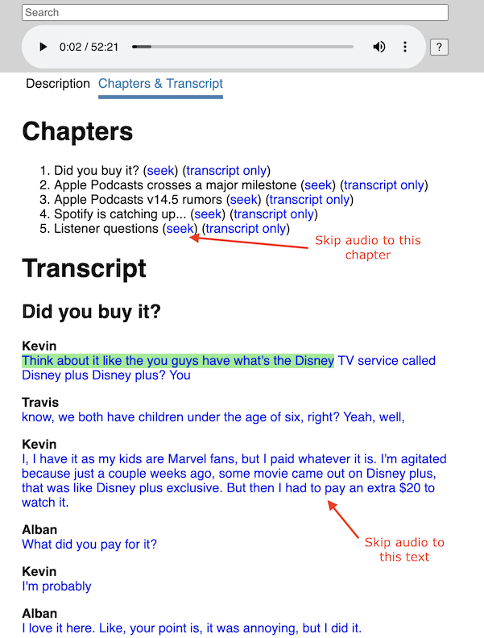

# Podcast Transcript Demo

This is a toy podcast player that demonstrates the [`<podcast:transcript>`](https://github.com/Podcastindex-org/podcast-namespace/tree/aed4b39054fcec3702d290f2d8fe8a90057398ea/transcripts/transcripts.md) and [`<podcast:chapters>`](https://github.com/Podcastindex-org/podcast-namespace/tree/aed4b39054fcec3702d290f2d8fe8a90057398ea/chapters/jsonChapters.md) tags that were [designed by Podcast Index for podcast RSS feeds](https://github.com/Podcastindex-org/podcast-namespace/tree/aed4b39054fcec3702d290f2d8fe8a90057398ea/README.md). These tags enable podcast authors to make episode transcripts and chapter information available to all podcast players.

These tags are fairly new. My hope with this demo is to spread awareness of these tags so that more podcast authors and podcast players adopt them.

## Table of Contents

- [Demo](#Demo)
- [Motivating Scenario](#Motivating-Scenario)
- [Using the Transcript Tag](#Using-the-Transcript-Tag)
- [Using the Chapters Tag](#Using-the-Chapters-Tag)
- [Demo Limitations](#Demo-Limitations)
- [References](#References)

## Demo

[This demo](https://rigdern.github.io/podcast-transcript-demo/index.html?collectionId=1446336657&episodeGuid=Buzzsprout-8212589) illustrates how a podcast player can use the transcript and chapter information to enable users to skip the audio to different portions of the podcast.

Here's a screenshot of the demo:

[](https://rigdern.github.io/podcast-transcript-demo/index.html?collectionId=1446336657&episodeGuid=Buzzsprout-8212589)

## Motivating Scenario

Here's an example scenario of the usefulness of podcast transcripts.

Suppose you're listening to a podcast while driving and hear an interesting remark about how the world's population is on a path to decrease by the year 2100. When you're back at home, you decide to revisit that part of the podcast. Without a transcript, it would be difficult to find the appropriate spot in this hour-long podcast. With a transcript, it's pretty easy. Search the podcast transcript for a keyphrase like "2100" and click on it to seek the audio to the appropriate timestamp.

## Using the Transcript Tag

For full details see the [documentation for the &lt;podcast:transcript&gt; tag](https://github.com/Podcastindex-org/podcast-namespace/tree/aed4b39054fcec3702d290f2d8fe8a90057398ea/transcripts/transcripts.md). Here are high-level instructions for how to use it when publishing a podcast episode:

1. Generate a transcript for your podcast episode. Services such as [rev.ai](https://www.rev.ai/) can do this work for you.
1. Upload your transcript to a web server.
1. Update your RSS feed to include a reference to the transcript. This is done via the `<podcast:transcript>` tag. Here's an example from an episode from the [RSS feed for the Buzzcast podcast](https://feeds.buzzsprout.com/231452.rss):
    ```
    <podcast:transcript
      url="https://feeds.buzzsprout.com/231452/8289235/transcript"
      type="text/html"
    />
    <podcast:transcript
      url="https://feeds.buzzsprout.com/231452/8289235/transcript.json"
      type="application/json"
    />
    <podcast:transcript
      url="https://feeds.buzzsprout.com/231452/8289235/transcript.srt"
      type="application/srt"
    />
    ```

## Using the Chapters Tag

For full details see the [documentation for the &lt;podcast:chapters&gt; tag](https://github.com/Podcastindex-org/podcast-namespace/tree/aed4b39054fcec3702d290f2d8fe8a90057398ea/chapters/jsonChapters.md). Here are high-level instructions for how to use it when publishing a podcast episode:

1. Create the chapters for your podcast episode. Apps such as [Podcast Chapters](https://chaptersapp.com/) can help you with this.
1. Upload your chapters file to a web server.
1. Update your RSS feed to include a reference to the chapters file. This is done via the `<podcast:chapters>` tag. Here's an example from an episode from the [RSS feed for the Buzzcast podcast](https://feeds.buzzsprout.com/231452.rss):
    ```
    <podcast:chapters
      url="https://feeds.buzzsprout.com/231452/8289235/chapters.json"
      type="application/json"
    />
    ```

## Demo Limitations

- Some podcasts cannot be loaded because their RSS feeds do not include an `Access-Control-Allow-Origin` header. Fetching such RSS feeds is blocked by CORS policy. There aren't any good solutions for this for this demo:
  - Creating and maintaining a server to fetch podcast RSS feeds would solve this. However, this is out of scope for this demo client which currently doesn't require any server code.
  - Distributing this demo as a desktop application would solve this. However, this would add friction to the demo because users would have to install an app rather than just visit a web page.

## References

- [Documentation for the &lt;podcast:transcript&gt; tag](https://github.com/Podcastindex-org/podcast-namespace/tree/aed4b39054fcec3702d290f2d8fe8a90057398ea/transcripts/transcripts.md)
- [Documentation for the &lt;podcast:chapters&gt; tag](https://github.com/Podcastindex-org/podcast-namespace/tree/aed4b39054fcec3702d290f2d8fe8a90057398ea/chapters/jsonChapters.md)
- [Documentation for other podcast tag proposals](https://github.com/Podcastindex-org/podcast-namespace/tree/aed4b39054fcec3702d290f2d8fe8a90057398ea/README.md)
- [List of podcast software and the features they support](https://podcastindex.org/apps) (e.g. transcripts, chapters)